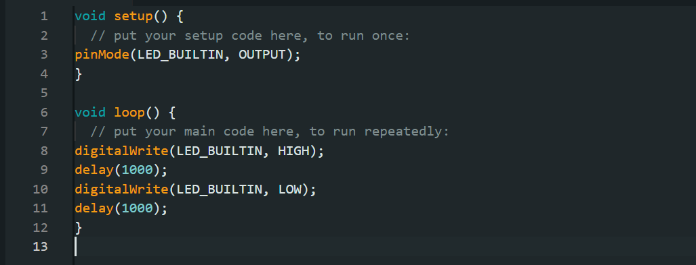
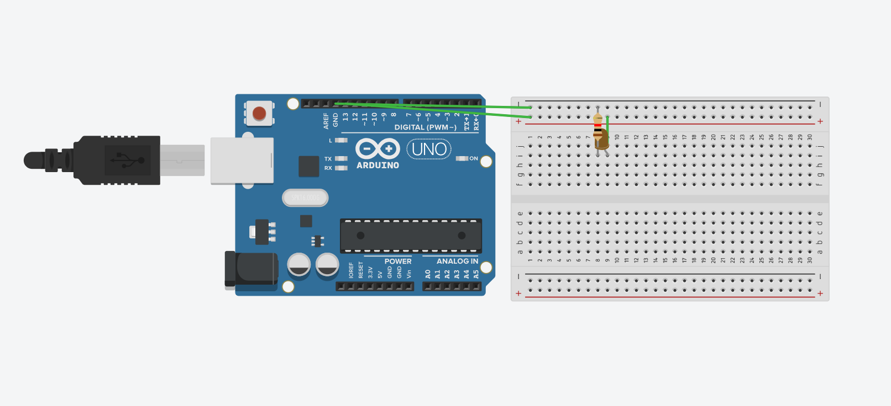

# HELLO-LBL04
## Código
Após instalar o Arduido IDE e conectar na porta certa, insira esse código:

```
void setup() {
  // put your setup code here, to run once:
pinMode(LED_BUILTIN, OUTPUT);
}

void loop() {
  // put your main code here, to run repeatedly:
digitalWrite(LED_BUILTIN, HIGH);
delay(1000);
digitalWrite(LED_BUILTIN, LOW);
delay(1000);
}
```



## Vídeo

Esse vídeo evidencia o funcionamento:

<video width="640" height="480" controls>
  <source src="video_funcionamento__1.mp4" type="video/mp4">
</video>

Link: [Video](https://drive.google.com/file/d/1HyOpZjnPIvo7WHfZWJVZKbYFeA9lgTOo/view?usp=sharing)

(Video incluso no repositório).

## Tinkercad
Projeto criado no Tinkercad.



Código:

```
void setup() {
  // put your setup code here, to run once:
pinMode(LED_BUILTIN, OUTPUT);
}

void loop() {
  // put your main code here, to run repeatedly:
digitalWrite(LED_BUILTIN, HIGH);
delay(1000);
digitalWrite(LED_BUILTIN, LOW);
delay(1000);
}
```

Link: [TinkerCad](https://www.tinkercad.com/things/2jHR1FPbIkX-fabulous-bruticus-amur/editel?returnTo=https%3A%2F%2Fwww.tinkercad.com%2Fdashboard&sharecode=hjd0CsEgOrJu5QLtLi8XSM3oYd2A3-W3KJj14cnm7nw)
